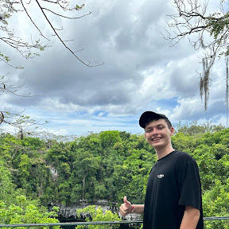

# ¡Hola! Soy Juan Diego Niño Solano 👋

Ingeniero de Sistemas con el chip de resolver problemas siempre encendido. Me enfoco en crear soluciones que no solo funcionen, sino que sean fáciles de mantener y escalar. Actualmente, mi "patio de juegos" principal es el ecosistema de **Laravel**.

- 🔭 **En qué ando:** Construyendo aplicaciones robustas y explorando el potencial de PHP moderno.
- ⚡ **Mi filosofía:** Si se puede automatizar, se debe automatizar. Clean code > código "inteligente".
- 💬 **Hablemos de:** Arquitectura de software, el ecosistema de Laravel, o por qué PHP está más vivo que nunca.

---

### 🛠️ Tecnologías y Herramientas

| Categoría | Mi Stack Principal |
| :--- | :--- |
| **Framework Favorito** |  |
| **Backend** | Node.js, Python, Java (Spring Boot) |
| **Frontend** | React, Angular, Tailwind CSS |
| **Bases de Datos** | PostgreSQL, MongoDB, Redis |
| **DevOps** | AWS, Docker, CI/CD |

---

### 🚀 Subiendo de nivel (Learning Path)

Aunque Laravel es mi base actual, estoy expandiendo mis fronteras hacia:
* **Estructuras de alto rendimiento:** Profundizando en **Rust** y **Go**.
* **Inteligencia Artificial:** Integrando LLMs para potenciar aplicaciones web.
* **Testing Avanzado:** TDD y pruebas de arquitectura para aplicaciones infalibles.

---